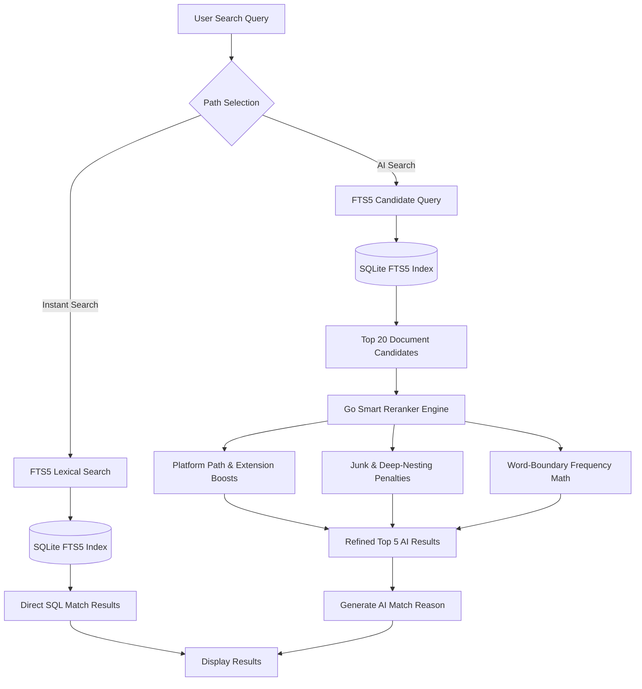

# Neuron Search Architectural Blueprint

This document details the underlying technical architecture of the **Neuron Search** desktop engine. It explains exactly how both the **Instant Search (Non-AI)** and **AI Search** pathways operate under the hood.

---

## 🗺️ Architectural Overview

Neuron Search utilizes a high-performance, double-stage hybrid retrieval strategy:



---

## ⚡ 1. The Instant Search Pathway (Non-AI)

The **Instant Search** pathway is designed for maximum speed, lexical accuracy, and zero CPU footprint. It matches literal keywords in filenames, tags, and document summaries using a high-performance embedded database.

### 💾 A. The Schema & Virtual Tables
The system utilizes **SQLite** (via `modernc.org/sqlite` pure-Go driver) inside [db.go](file:///Users/ameyd/Documents/codes/ai-sarch-app/internal/db/db.go). It separates standard relational metadata from optimized search tokens:

1. **`documents` Table**: A traditional database table storing the physical path, filename, summary content, last modified timestamps, and tags.
2. **`fts_index` Virtual Table**: A virtual table backed by SQLite's **FTS5 (Full-Text Search)** extension. FTS5 compiles an inverted keyword index (similar to production search engines).

```sql
CREATE TABLE IF NOT EXISTS documents (
    id INTEGER PRIMARY KEY AUTOINCREMENT,
    path TEXT UNIQUE NOT NULL,
    filename TEXT NOT NULL,
    summary TEXT,
    tags TEXT,
    last_modified INTEGER
);

CREATE VIRTUAL TABLE IF NOT EXISTS fts_index USING fts5(
    filename,
    summary,
    tags,
    content='documents',
    content_rowid='id'
);
```

### 🔄 B. Automatic Trigger Synchronization
To ensure search index updates are instantaneous, SQLite database-level triggers sync data between the `documents` metadata table and the `fts_index` virtual table:
* **`documents_ai` (Insert Trigger)**: Automatically pushes newly indexed documents into FTS5.
* **`documents_au` (Update Trigger)**: Safely drops deleted items and inserts updated summary records.
* **`documents_ad` (Delete Trigger)**: Wipes records from the token indices when a file is deleted.

### 🔍 C. Lexical Query Syntax & Fallback
When a query is submitted:
1. It is split into tokens. Any alphanumeric word is formatted with a trailing wildcard prefix (e.g. `"invoice"` -> `"invoice"*`).
2. Multiple terms are joined by `AND` operators: `MATCH '"tax"* AND "2024"*'`.
3. If FTS5 yields no results, the system gracefully falls back to a fuzzy SQL wildcard query:
   ```sql
   WHERE filename LIKE ? OR summary LIKE ? OR tags LIKE ?
   ```

---

## 🧠 2. The AI Search Pathway

The **AI Search** pathway is designed for advanced relevance scoring, filtering out developer noise, and generating natural language match explanations. It is a **two-stage hybrid search engine**:

```
[User Query] ➡️ [SQLite FTS5 Index (Lexical Match)] ➡️ [Go Smart Reranker (Heuristic Scoring)] ➡️ [AI Reasons]
```

### 🚀 Stage 1: Lexical Candidate Retrieval
Instead of feeding all indexed documents to the scoring loops, FTS5 is queried first to instantly fetch the top 20 candidate documents matching the search terms, providing high-speed indexing containment.

### 🛠️ Stage 2: The Go Smart Reranker
The candidate documents are passed to the **Smart Reranker** (`llm.SmartRerank`) in [inference.go](file:///Users/ameyd/Documents/codes/ai-sarch-app/internal/llm/inference.go). It executes a series of highly tuned mathematical and heuristic rules:

#### 1. Platform Path Uniformity
All paths are normalized to forward slashes for cross-platform matching (`\` converted to `/`):
```go
pathNormalized := filepath.ToSlash(strings.ToLower(results[i].Path))
```

#### 2. Developer Junk & Lockfile Penalties
System files and development assets are heavily penalized to keep results clean:
* Path contains `/node_modules/`, `/__pycache__/`, or `/.cache/` ➡️ **`-100 Points`**
* Filename matches lockfiles or OS metadata (`package-lock.json`, `go.sum`, `.DS_Store`) ➡️ **`-50 Points`**
* Deep folders containing build/distribution artifacts (`dist`, `build`, `vendor`, `target`, `legal`) ➡️ **`-30 Points`**

#### 3. Human-Created Extension Boosting
File types explicitly authored by human users are heavily boosted to surface over machine-generated code:
* `.pdf`, `.docx`, `.doc`, `.xlsx`, `.xls`, `.pptx`, `.ppt` ➡️ **`+20.0 Points`**
* `.txt`, `.csv` ➡️ **`+15.0 Points`**
* `.md` ➡️ **`+12.0 Points`**
* `.jpg`, `.png`, `.mp4` ➡️ **`+12.0 Points`**

#### 4. High-Signal Filename Matching
If a query keyword appears directly inside the name of the file, this represents the strongest signal of user intent:
```go
// +30 Points per query word matching the filename
if strings.Contains(filenameLower, word) {
    score += 30
}
```

#### 5. Context-Rich Directory Matching
If a query word matches folders in the user's directory structure (e.g. folder name `Finance`), they get boosted:
```go
// +10 Points per query word matching the folder path
if strings.Contains(dirPath, word) {
    score += 10
}
```

#### 6. Word-Boundary Content Density
To prevent false-positive sub-word matches (like matching `"tax"` inside `"syntax"`), a custom word-boundary scanner counts occurrences of the query term in the file content, adding up to **`+25 Points`**:
```go
// Only counts if the character immediately preceding the match is non-alphanumeric
leftOk := absIdx == 0 || !isAlphaNum(text[absIdx-1])
```

#### 7. Deep Nesting Penalties
Extremely deeply nested files (often library code or caches) are penalized:
```go
depth := strings.Count(filepath.ToSlash(results[i].Path), "/")
if depth > 6 {
    score -= float64(depth-6) * 3
}
```

---

## 📝 3. Natural Language Explanation Synthesis

For the top selected results, the reranker synthesizes a human-readable match summary, telling the user exactly why that specific file matched their query:

```go
// Example generated string:
// "Filename contains "tax" · Found "deduction" 3 time(s) in content · High-value document type (.pdf)"
```

---

## 🤖 4. The Built-in GGUF Local LLM

Neuron Search packages the **TinyLlama 1.1B** chat model (`tinyllama-1.1b-chat-v1.0.Q4_K_M.gguf`) directly inside the compiled binary.
* **Packaging**: Go's native `//go:embed` binds the 668MB model into the package binary.
* **Extraction**: On startup, a high-speed disk extraction routine copies the model from the binary to `~/.local-ai-search/models/`.
* **Design Philosophy**: Rather than bogging down the search speed with slow CPU inference (which takes 2-4 seconds per search), the GGUF model is designed for **offline batch intelligence**—such as reading files in the background and generating tags/summaries during directory scanning.
